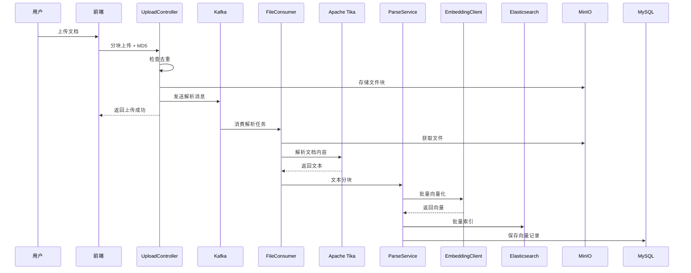
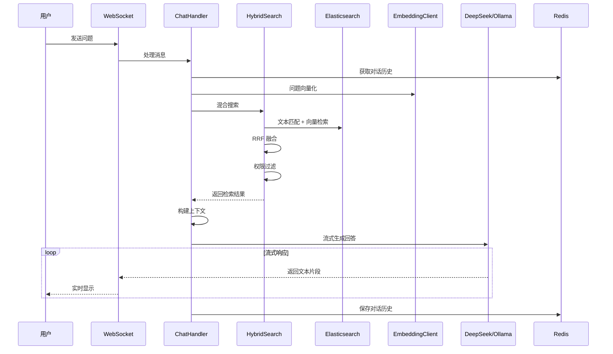

# 派聪明（PaiSmart）项目详细介绍

## 📋 项目概述

**派聪明（PaiSmart）** 是一个企业级的 **AI 知识库管理系统**，采用先进的 **检索增强生成（RAG）** 技术，为企业和个人提供智能文档处理、知识检索和 AI 问答能力。

### 🎯 核心价值
- ✅ **智能文档管理**：支持多种文档格式的上传、解析和索引
- ✅ **混合搜索引擎**：结合文本匹配和向量相似度的智能检索
- ✅ **RAG 智能问答**：基于私有知识库的 AI 对话助手
- ✅ **多租户架构**：支持组织标签体系，实现数据隔离和权限控制
- ✅ **实时流式对话**：WebSocket 实现的流式 AI 响应

---

## 🏗️ 技术架构

### 后端技术栈

| 技术 | 版本 | 用途 |
|------|------|------|
| **Spring Boot** | 3.4.2 | 核心框架 |
| **Java** | 17 | 编程语言 |
| **MySQL** | 8.0 | 关系型数据库 |
| **Spring Data JPA** | - | ORM 框架 |
| **Redis** | 7.0.11 | 缓存和会话管理 |
| **Elasticsearch** | 8.10.0 | 全文搜索和向量检索 |
| **Apache Kafka** | 3.2.1 | 消息队列，异步文件处理 |
| **MinIO** | 8.5.12 | 对象存储，文件管理 |
| **Apache Tika** | 2.9.1 | 文档解析 |
| **Spring Security** | - | 安全认证 |
| **JWT** | 0.11.5 | Token 认证 |
| **WebSocket** | - | 实时通信 |
| **WebFlux** | - | 响应式编程，AI API 调用 |
| **HanLP** | 1.8.6 | 中文分词 |

### 前端技术栈

| 技术 | 版本 | 用途 |
|------|------|------|
| **Vue 3** | - | 前端框架 |
| **TypeScript** | - | 类型安全 |
| **Vite** | - | 构建工具 |
| **Naive UI** | - | UI 组件库 |
| **Pinia** | - | 状态管理 |
| **Vue Router** | - | 路由管理 |
| **UnoCSS** | - | 原子化 CSS |
| **pnpm** | >=8.7.0 | 包管理器 |

### AI 集成

- **本地部署**：Ollama + qwen3:8b / deepseek-r1:7b
- **云端服务**：DeepSeek API
- **向量嵌入**：通义千问 text-embedding-v4 (2048 维)
- **向量存储**：Elasticsearch 的 dense_vector 字段

---

## 📂 项目结构

### 后端结构
```
src/main/java/com/yizhaoqi/smartpai/
├── SmartPaiApplication.java          # 应用入口
├── client/                           # 外部 API 客户端
│   ├── DeepSeekClient.java          # DeepSeek/Ollama API 客户端
│   └── EmbeddingClient.java         # 向量嵌入 API 客户端
├── config/                          # 配置类
│   ├── SecurityConfig.java          # Spring Security 配置
│   ├── JwtAuthenticationFilter.java # JWT 过滤器
│   ├── ElasticsearchConfig.java     # ES 配置
│   └── WebSocketConfig.java         # WebSocket 配置
├── consumer/                        # Kafka 消费者
│   └── FileProcessingConsumer.java  # 文件处理消费者
├── controller/                      # REST API 控制器
│   ├── AuthController.java          # 认证接口
│   ├── UserController.java          # 用户管理
│   ├── UploadController.java        # 文件上传
│   ├── DocumentController.java      # 文档管理
│   ├── ChatController.java          # WebSocket 聊天
│   ├── SearchController.java        # 搜索接口
│   └── ConversationController.java  # 对话管理
├── entity/                          # 实体类
│   ├── EsDocument.java              # ES 文档实体
│   ├── SearchResult.java            # 搜索结果
│   └── TextChunk.java               # 文本分块
├── model/                           # 领域模型
│   ├── User.java                    # 用户模型
│   ├── FileUpload.java              # 文件上传记录
│   ├── OrganizationTag.java         # 组织标签
│   └── DocumentVector.java          # 文档向量
├── repository/                      # 数据访问层
│   ├── UserRepository.java
│   ├── FileUploadRepository.java
│   └── DocumentVectorRepository.java
├── service/                         # 业务逻辑层
│   ├── ChatHandler.java             # 聊天处理
│   ├── HybridSearchService.java     # 混合搜索
│   ├── ElasticsearchService.java    # ES 服务
│   ├── VectorizationService.java    # 向量化服务
│   ├── DocumentService.java         # 文档服务
│   ├── UploadService.java           # 上传服务
│   ├── ParseService.java            # 解析服务
│   └── ConversationService.java     # 对话服务
└── utils/                           # 工具类
```

### 前端结构
```
frontend/src/
├── App.vue                          # 根组件
├── main.ts                          # 应用入口
├── sockert.js                       # WebSocket 客户端
├── components/                      # 可复用组件
│   ├── common/                      # 通用组件
│   ├── custom/                      # 自定义组件
│   └── advanced/                    # 高级组件
├── views/                           # 页面组件
│   ├── chat/                        # 聊天页面
│   ├── knowledge-base/              # 知识库管理
│   ├── chat-history/                # 对话历史
│   ├── org-tag/                     # 组织标签管理
│   ├── user/                        # 用户管理
│   └── personal-center/             # 个人中心
├── router/                          # 路由配置
├── store/                           # Pinia 状态管理
├── service/                         # API 服务层
├── layouts/                         # 页面布局
├── hooks/                           # 组合式函数
└── utils/                           # 工具函数
```

---

## 🔑 核心功能模块

### 1. 用户认证与权限管理
- **JWT Token** 认证机制
- **角色管理**：USER、ADMIN 两种角色
- **组织标签体系**：支持层级组织结构
- **权限控制**：基于用户、组织标签的细粒度权限

### 2. 文档上传与处理
- **分块上传**：支持大文件断点续传
- **文件去重**：基于 MD5 的文件去重机制
- **异步处理**：Kafka 实现的异步文件解析
- **多格式支持**：PDF、Word、Excel、PPT、TXT 等
- **Apache Tika 解析**：自动提取文档内容

### 3. 智能索引与向量化
- **文本分块**：智能切分文档为可检索的文本块
- **向量嵌入**：调用通义千问 API 生成 2048 维向量
- **批量处理**：优化的批量向量化流程
- **增量索引**：实时更新 Elasticsearch 索引

### 4. 混合搜索引擎
- **文本匹配**：基于 Elasticsearch 的全文检索
- **向量检索**：kNN 近似最近邻搜索
- **RRF 融合**：Reciprocal Rank Fusion 算法融合结果
- **权限过滤**：确保用户只能检索有权限的文档
- **中文分词**：HanLP 优化中文搜索效果

### 5. RAG 智能问答
- **检索增强生成**：基于知识库的 AI 回答
- **对话历史管理**：Redis 存储多轮对话上下文
- **流式响应**：WebSocket 实现的实时流式输出
- **引用标注**：自动标注答案来源文档
- **提示词工程**：优化的 System Prompt 控制回答质量

### 6. 知识库管理
- **文档 CRUD**：完整的文档生命周期管理
- **公开/私有**：文档访问权限控制
- **组织隔离**：多租户数据隔离
- **批量操作**：批量删除、移动文档

### 7. 对话管理
- **对话历史**：完整的对话记录存储
- **会话恢复**：支持恢复历史对话
- **多会话管理**：用户可创建多个对话会话

---

## 🗄️ 数据库设计

### 核心表结构

#### users（用户表）
```sql
- id: 用户唯一标识
- username: 用户名（唯一）
- password: 加密密码
- role: 用户角色（USER/ADMIN）
- org_tags: 组织标签（逗号分隔）
- primary_org: 主组织标签
- created_at/updated_at: 时间戳
```

#### organization_tags（组织标签表）
```sql
- tag_id: 标签 ID
- name: 标签名称
- description: 描述
- parent_tag: 父标签 ID（支持层级）
- created_by: 创建者
```

#### file_upload（文件上传记录）
```sql
- id: 主键
- file_md5: 文件 MD5（去重）
- file_name: 文件名
- total_size: 文件大小
- status: 上传状态
- user_id: 上传者
- org_tag: 组织标签
- is_public: 是否公开
```

#### document_vectors（文档向量）
```sql
- vector_id: 向量 ID
- file_md5: 关联文件
- chunk_id: 文本块序号
- text_content: 文本内容
- user_id: 上传者
- org_tag: 组织标签
- is_public: 是否公开
（向量数据存储在 Elasticsearch）
```

---

## 🚀 核心流程

### 文档上传与索引流程


### RAG 智能问答流程


---

## 🔧 关键技术实现

### 1. 混合搜索算法
```java
// HybridSearchService.java 核心逻辑
public List<SearchResult> searchWithPermission(String query, String userId, int topK) {
    // 1. 获取用户权限标签
    List<String> userOrgTags = getUserEffectiveOrgTags(userId);
    
    // 2. 生成查询向量
    List<Float> queryVector = embeddingClient.embedQuery(query);
    
    // 3. Elasticsearch 混合查询
    SearchResponse<EsDocument> response = esClient.search(s -> s
        .index("document_vectors")
        .query(q -> q
            .bool(b -> b
                // 文本匹配
                .should(sh -> sh.match(m -> m
                    .field("text_content")
                    .query(query)
                ))
                // 向量相似度
                .should(sh -> sh.knn(k -> k
                    .field("embedding")
                    .queryVector(queryVector)
                    .k(topK * 2)
                ))
                // 权限过滤
                .filter(f -> f.bool(bf -> bf
                    .should(s1 -> s1.term(t -> t.field("user_id").value(userId)))
                    .should(s2 -> s2.term(t -> t.field("is_public").value(true)))
                    .should(s3 -> s3.terms(t -> t.field("org_tag").terms(userOrgTags)))
                ))
            )
        )
        // RRF 重排序
        .rank(r -> r.rrf(rrf -> rrf.windowSize(50).rankConstant(60)))
        .size(topK)
    );
    
    return parseResults(response);
}
```

### 2. 流式 AI 响应
```java
// DeepSeekClient.java
public void streamResponse(String userMessage, String context, 
                          List<Map<String, String>> history,
                          Consumer<String> onChunk,
                          Consumer<Throwable> onError) {
    // 构建消息
    List<Map<String, String>> messages = buildMessages(context, history, userMessage);
    
    // WebFlux 流式调用
    webClient.post()
        .uri("/chat/completions")
        .bodyValue(buildRequestBody(messages))
        .retrieve()
        .bodyToFlux(String.class)
        .map(this::extractContent)  // 解析 SSE 数据
        .subscribe(
            chunk -> onChunk.accept(chunk),  // 处理每个片段
            error -> onError.accept(error)   // 错误处理
        );
}
```

### 3. 组织标签权限控制
```java
// 支持层级组织结构
// 例如：用户属于 "tech/backend"，则可访问 "tech" 和 "tech/backend" 的文档
public List<String> getUserEffectiveOrgTags(String userId) {
    User user = userRepository.findById(userId);
    List<String> effectiveTags = new ArrayList<>();
    
    for (String tag : user.getOrgTags()) {
        effectiveTags.add(tag);
        // 添加所有父标签
        String parentTag = orgTagCacheService.getParentTag(tag);
        while (parentTag != null) {
            effectiveTags.add(parentTag);
            parentTag = orgTagCacheService.getParentTag(parentTag);
        }
    }
    
    return effectiveTags;
}
```

---

## ⚙️ 配置说明

### application.yml 核心配置
```yaml
server:
  port: 8081

spring:
  datasource:
    url: jdbc:mysql://localhost:3306/PaiSmart
    username: root
    password: ***
  
  redis:
    host: localhost
    port: 6379
  
  kafka:
    bootstrap-servers: 127.0.0.1:9092
    consumer:
      group-id: file-processing-group
    topic:
      file-processing: file-processing-topic1

elasticsearch:
  host: localhost
  port: 9200
  username: elastic
  password: ***

minio:
  endpoint: http://localhost:9000
  accessKey: minioadmin
  secretKey: minioadmin
  bucketName: uploads

deepseek:
  api:
    url: http://localhost:11434/v1  # 本地 Ollama
    model: qwen3:8b
    key: ""  # 本地为空

embedding:
  api:
    url: https://dashscope.aliyuncs.com/compatible-mode/v1
    key: ***
    model: text-embedding-v4
    dimension: 2048

ai:
  prompt:
    rules: |
      你是派聪明知识助手，须遵守：
      1. 仅用简体中文作答
      2. 回答需先给结论，再给论据
      3. 如引用参考信息，请在句末加 (来源#编号: 文件名)
      4. 若无足够信息，请回答"暂无相关信息"
```

---

## 🐳 部署方式

### Docker Compose 一键部署
```bash
# 启动所有依赖服务
cd docs
docker-compose up -d

# 包含服务：MySQL、MinIO、Redis、Kafka、Elasticsearch
```

### 后端启动
```bash
# Maven 启动
mvn spring-boot:run

# 或打包运行
mvn clean package
java -jar target/SmartPAI-0.0.1-SNAPSHOT.jar
```

### 前端启动
```bash
cd frontend
pnpm install
pnpm dev  # 开发环境
pnpm build  # 生产构建
```

---

## 📊 项目成果

根据 README 显示，派聪明已帮助多位学习者成功斩获：
- 🏆 招银网络
- 🏆 科大讯飞
- 🏆 合合信息
- 🏆 小红书
- 🏆 网易
- 🏆 以及众多日常实习 offer

---

## 🎓 学习价值

### 技术亮点
1. **RAG 完整实现**：从文档解析到向量检索到 AI 生成的完整链路
2. **混合搜索**：文本匹配 + 向量相似度的融合算法
3. **异步架构**：Kafka 实现的异步文件处理
4. **流式响应**：WebSocket + WebFlux 的实时通信
5. **多租户设计**：完善的权限和数据隔离机制
6. **微服务化**：模块化的代码结构，易于扩展

### 适合人群
- ✅ Java 后端开发者：学习 Spring Boot 企业级开发
- ✅ AI 应用开发者：深入理解 RAG 技术栈
- ✅ 全栈开发者：Vue 3 + Spring Boot 完整实践
- ✅ 求职者：高质量的项目经验，面试加分项

---

## 📝 总结

**派聪明（PaiSmart）** 是一个技术栈全面、架构设计合理、功能完善的企业级 RAG 知识库系统。它不仅实现了从文档上传到智能问答的完整业务流程，更展示了如何将 **Elasticsearch、Kafka、Redis、AI API** 等现代技术栈有机整合。

对于学习者来说，这是一个**理论与实践完美结合**的项目，既能学习到前沿的 AI 应用开发，又能掌握企业级系统的架构设计。无论是用于学习提升，还是作为面试项目，都是一个非常优秀的选择！

---

## 🔗 相关链接
- GitHub: https://github.com/itwanger/PaiSmart
- 社区: 需扫码加入知识星球

---

*本文档由 AI 助手学习项目代码后自动生成，最后更新于 2026-01-04*

